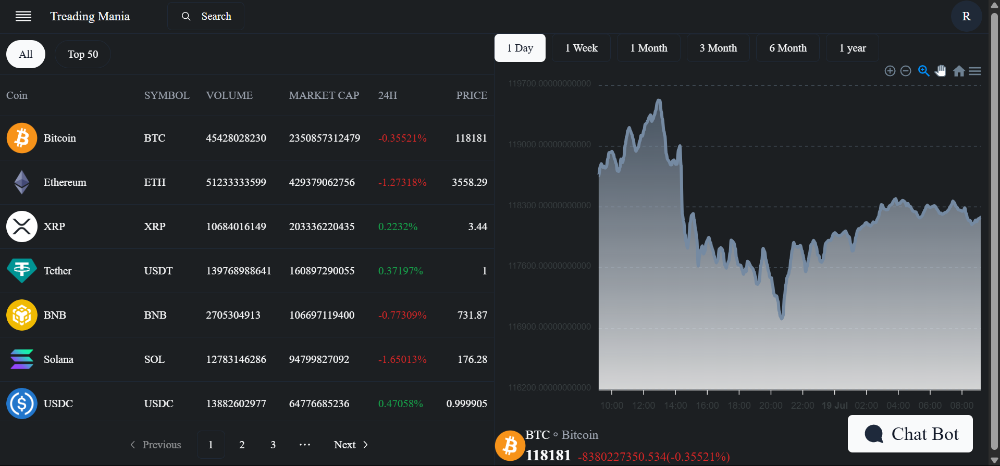

# FullStack Treading Platform 💹

This is a full-stack cryptocurrency trading platform built with **React.js** for the frontend and **Spring Boot** for the backend (in another repo). It offers features such as authentication, live coin data, wallet tracking, and transaction management with a clean and modern UI.

---

## 🌐 Live Demo
**Coming Soon**

---

## 📸 Screenshots
Key Features
User Authentication
-Secure login and registration system

-Password recovery functionality

-Two-step verification (2FA) for enhanced security


### 1. 📝 Register Page


---

### 2. 🔐 Login Page


---

### 3. ❌ Login Error Page


---

### 4. 🏠 Home Page


---

### 5. 🤖 Home Page with ChatBot


---

### 6. 📚 Sidebar Navigation


---

### 7. 📈 Coin Details Page


---

### 8. 👛 Wallet Page


---
Portfolio Management
-Wallet balance tracking

-Transaction history

-Payment details management
### 9. 💳 Payment Detail Page


---
User Profile
-Personal information management

-Account security settings

-Profile customization


### 10. 👤 Profile Page


---

### 11. 🔁 Buy/Sell Page


---

AI-Powered Chatbot
-Gemini AI integration for crypto-related queries

-Real-time price and market cap information

-Natural language processing for user queries


## 🚀 Tech Stack

- **Frontend**: React.js, TailwindCSS, ShadCN
- **Backend**: Spring Boot (separate repository)
- **Database**: MySQL
- **Authentication**: JWT
- **State Management**: React Context API
- **API**: CoinGecko for live market data

---


Technology Stack
Frontend
-React.js - Core frontend framework

-Axios - HTTP client for API communication

-Chart.js - Data visualization for market trends

-Material-UI - UI component library

-React Router - Navigation and routing

Backend
-Spring Boot - Java backend framework

-Spring Security - Authentication and authorization

-JWT - Token-based authentication

-WebSocket - Real-time data updates

Database
-MySQL - Relational database for user data and transactions

-Redis - Caching for performance optimization

AI Integration
-Gemini AI - Natural language processing for chatbot

Frontend Setup
cd client
npm install
npm start

Backend Setup
cd server
./mvnw spring-boot:run

Usage
 1. Registration: Create a new account via the registration page

 2. Login: Access your dashboard with secure credentials

3. Market View: Browse cryptocurrencies with real-time data

4. Trading: Execute buy/sell orders from the trading interface

5. Portfolio: Monitor your investments and transaction history

6. Chatbot: Ask crypto-related questions to the AI assistant

🔮 Future Enhancements
🧠 AI Market Prediction

📱 Mobile App (iOS & Android)

🏆 Leaderboards & Community Trading

🔄 More Exchange Integrations

🛡️ Advanced Trade Options (limit orders, stop-loss, etc.)

Contributing
We welcome contributions! Please follow these steps:

 1. Fork the repository

 2. Create your feature branch (git checkout -b feature/AmazingFeature)

 3. Commit your changes (git commit -m 'Add some AmazingFeature')

 4. Push to the branch (git push origin feature/AmazingFeature)

 5. Open a Pull Request


## 🛠️ Setup Instructions

```bash
git clone https://github.com/Ravindrabijarniya/FullStack-Treading-platform.git
cd FullStack-Treading-platform
npm install
npm run dev

Trading - Revolutionizing cryptocurrency trading with AI-powered insights and seamless user experience.

Made with ❤️ by Ravindra Bijarniya
🔗 LinkedIn
📧 Email: ravindrabijarniya123@gmail.com
